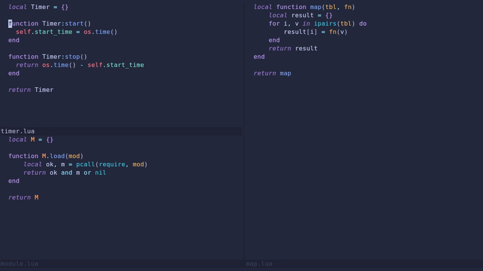
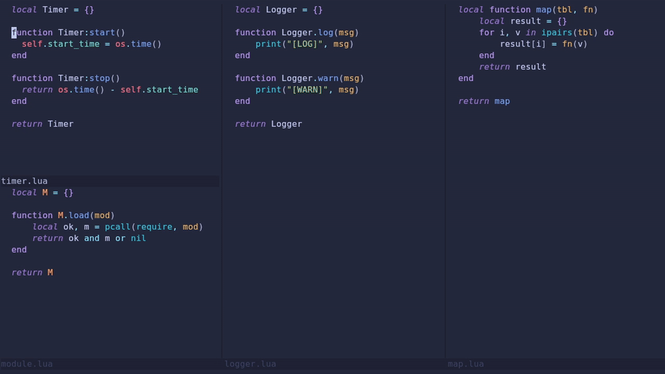
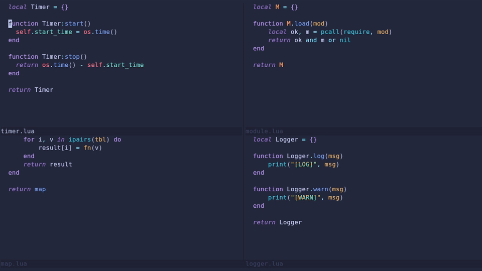

# windowcolumns.nvim

Column-first window management for Neovim.

---

## What is windowcolumns.nvim?

**windowcolumns.nvim** helps you manage your Neovim layout with a column-first (vertical split–oriented) workflow.
It lets you create full-height vertical splits, move entire columns of horizontal splits, and reposition windows between columns.

> ⚠️ Note: This plugin is not compatible with vertical splits nested inside horizontal splits.

---

## Functions

### `create_column(direction)`



Creates a new full-height vertical window (column) on the left or right of the current window.
Unlike a standard `:vsplit`, this works even when the current window is nested inside horizontal splits.

**Parameters**:
- `direction` *(optional)*: `'left'` or `'right'`.
  If omitted, it defaults to the `splitright` option.

**Example**:
```lua
require('windowcolumns').create_column('right')
```

---

### `move_column(direction)`



Moves the entire column (all horizontal splits in the current column) to the left or right.
This allows repositioning a group of vertically aligned windows as a unit.

**Parameters**:
- `direction`: `'left'` or `'right'`.

**Example**:
```lua
require('windowcolumns').move_column('right')
```

---

### `move_window(direction, column_opt)`



Moves the current window in the specified direction, with special logic for horizontal moves between columns.

- For `'up'` or `'down'`: moves the window vertically within the current column.
- For `'left'` or `'right'`: the behavior is determined by `column_opt`.

**Parameters**:
- `direction`: `'up'`, `'down'`, `'left'`, or `'right'`.
- `column_opt` (optional): `'new'`, `'existing'`, or `'both'`. Defaults to `'both'`.

**Column Option Behavior**:

- `'new'`: Moves the window out to a new column.
- `'existing'`: Moves the window into an existing column based on the cursor's screen row.
- `'both'`:
    - If the current column has multiple windows, move out to a new column.
    - If the current window is already in a single-window column, move into an existing column.

**Example**:
```lua
require('windowcolumns').move_window('right', 'new')
```

## Installation

Using [lazy.nvim](https://github.com/folke/lazy.nvim):
```lua
{
    'mkajsjo/windowcolumns.nvim',
    keys = {
        { '<leader>wv', function() require('windowcolumns').create_column() end },
        { '<leader>wh', function() require('windowcolumns').move_column('left') end },
        { '<leader>wl', function() require('windowcolumns').move_column('right') end },
        { '<leader>wj', function() require('windowcolumns').move_window('down') end },
        { '<leader>wk', function() require('windowcolumns').move_window('up') end },
        { '<leader>Wh', function() require('windowcolumns').move_window('left') end },
        { '<leader>Wl', function() require('windowcolumns').move_window('right') end },
    },
}
```

Using [vim-plug](https://github.com/junegunn/vim-plug):
```viml
Plug 'mkajsjo/windowcolumns.nvim'
```

Using [packer.nvim](https://github.com/wbthomason/packer.nvim):
```lua
use 'mkajsjo/windowcolumns.nvim'
```

**Example configuration if not using lazy.nvim**:
```lua
vim.keymap.set('n', '<leader>wv', function() require('windowcolumns').create_column() end)
vim.keymap.set('n', '<leader>wh', function() require('windowcolumns').move_column('left') end)
vim.keymap.set('n', '<leader>wl', function() require('windowcolumns').move_column('right') end)
vim.keymap.set('n', '<leader>wj', function() require('windowcolumns').move_window('down') end)
vim.keymap.set('n', '<leader>wk', function() require('windowcolumns').move_window('up') end)
vim.keymap.set('n', '<leader>Wh', function() require('windowcolumns').move_window('left') end)
vim.keymap.set('n', '<leader>Wl', function() require('windowcolumns').move_window('right') end)
```
